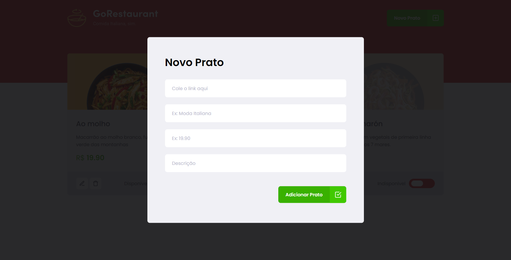

# Ignite Challenge - Refactor "legacy" code

<p align="left">
  <a href="https://www.linkedin.com/in/murilosambuite/"> 
    
  </a>
</p>

> App developed at [Rocketseat Ignite](https://www.rocketseat.com.br/ignite).

## :camera: Visual Demo

<p align="center">
   
</p>

<br />

<p align="center">
  
</p>

<p align="center">
  
</p>

<br />

---

<em>**THE CHALLENGE PROPOSAL**: I receive an application and I have to refactor all code from .js files to .ts files and from classes components to functional components, the challenge is done when the app is working as it was before the changes. </em>

---

## :hammer: Tools/Technologies

- **React** — A library to build user interfaces
- **React-modal** — React own library to create modal
- **React-icons** — A library with icon components
- **Styled-components** — CSS-in-JS library
- **Axios** — A HTTP Client for node.js and the browser
- **Unform** — A API for creating forms for both React and React Native
- **yup** — A library for validating data
- **JSON server** — API mocking library

<br />

---

## :computer: Installation

### Step by step to run the application on your machine:

Clone this repository
(You will need git installed) :

```
  git clone https://github.com/sambuite/desafio-refactoring-classes.git

  cd desafio-refactoring-classes
```

Run the following scripts
(You will need npm or yarn installed) :

```
  // Install the dependencies
  npm install

  // Start the application
  npm start
```

or if you use yarn

```
  // Install the dependencies
  yarn

  // Start the application
  yarn start
```
